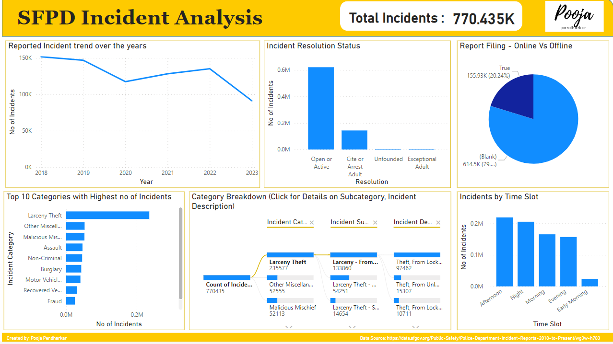
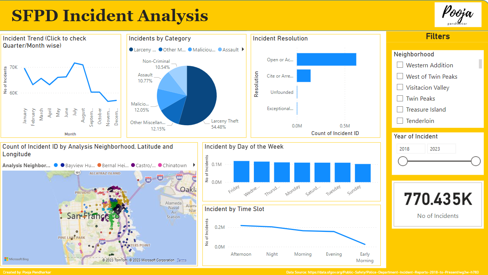

 # SFPD Crime Incident Analysis
 
## About 
The goal of this dashboard is to potentially equip the San Francisco Police Department with a tool to analyze incident data and make informed decisions.

## How to Setup the Dashboard
* Requirements: Power Bi Desktop App, Spyder/Jupyter, Dataset
* Download the dataset - https://data.sfgov.org/Public-Safety/Police-Department-Incident-Reports-2018-to-Present/wg3w-h783
* To Create the Dashboard from scratch please check the process in the blog - https://penpooja.medium.com/building-a-power-bi-dashboard-data-visualization-project-ae9c8a8ee167 (Please note it does not cover the basic of Power Bi)
* Alternatively you can also download the pbix file and open it on your device
  
## How to Use Dashboards
* Overview Page - Get the overview of Crime Incidents in San Francisco.
  * <ins>Key Insights:</ins>
    * Out of the 770.435K Incidents, around 20.24% are registered online
    * The category with highest number of incidents is Larceny Theft, where reported descriptions mention over 97462 cases of Theft of more than $950 worth of items from locked vehicles
    * All the online reported cases have Open/Active status
    * Afternoon and Night times are prime times for crime


* Filter Page - Filter the data based on Neighborhoods and Year to get key insights into the frequency, category etc for crime incidents. 
  * <ins>Key Insights:</ins>
    * Highest no of incidents are from neighborhoods of Mission and Tenderloin
    * Further analyzing the Mission neighborhood we can see that August month seems to attract the highest number of crimes over all the years (2018 to 2023) with Larceny Theft accounting for ~41% of crimes. 
    * For the Tenderloin area Drug Offence and Larceny Theft are two major contributors to incidents while the peak in incidents differs based on the years



### Important
* DAX Query to create Time Slot Column:
```
  Time Slot = 
VAR IncidentHour = HOUR([Incident Time])
VAR IncidentMinute = MINUTE([Incident Time])
VAR IncidentSecond = SECOND([Incident Time])
VAR TotalMinutes = (IncidentHour * 60) + IncidentMinute + (IncidentSecond / 60)
RETURN
    SWITCH(TRUE(),
        (TotalMinutes >= 240 && TotalMinutes <= 359), "Early Morning",
        (TotalMinutes >= 360 && TotalMinutes <= 719), "Morning",
        (TotalMinutes >= 720 && TotalMinutes <= 1019), "Afternoon",
        (TotalMinutes >= 1020 && TotalMinutes <= 1220), "Evening",
        (TotalMinutes >= 1221 && TotalMinutes <= 1439) || (TotalMinutes >= 0 && TotalMinutes <= 239), "Night",
        BLANK()
    )
```
